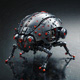

# PRODAFT Threat Intelligence

| Avatars | Threat Actors | Description | Motivation |
|-------|----------------|--------------|------------|
|  | [ArcaneMantis](ArcaneMantis/README.md) | Arcane Mantis (a.k.a. Vice Society, Rhysida) is a ransomware group that first appeared in the summer of 2021. | Ransomware |
|  | [CrypticSilverfish](CrypticSilverfish/README.md) | Cryptic Silverfish, also known as Evil Corp, is a notorious Russian cybercriminal group active since at least 2007. | Organized Crime |
|  | [DiabolicLadybug](DiabolicLadybug/README.md) | Diabolic Ladybug, also known as TA505, is a financially motivated cybercriminal group active since at least 2014, known for orchestrating large-scale malicious email campaigns to distribute various malware families.  | Financial Crime |
|  | [ElysianMantis](ElysianMantis/README.md) | Elysian Mantis, also known as Conti, was a ransomware group active from 2019 to 2022, known for operating a ransomware-as-a-service (RaaS) model.. | Ransomware |
|  | [LARVA-140](LARVA-140/README.md) | LARVA-140, also known as Brunhilda, is the threat actor behind the Brunhilda DaaS operation, an Android malware dropper targeting banking apps, cryptocurrency wallets, and social media platforms in specific regions. | Criminal Service |
|  | [LARVA-147](LARVA-147/README.md) | LARVA-147, also known as CryptoChameleon, UNK-12, or Perm, is a cybercriminal threat actor specializing in advanced phishing campaigns targeting cryptocurrency users and exchanges like Binance, Uphold, and Kraken. | Criminal Service |
|  | [LARVA-15](LARVA-15/README.md) | LARVA-15, also known as Wazawaka and identified as Mikhail Pavlovich Matveev, is a prominent cybercriminal linked to ransomware groups such as Monti, Ragnar Locker, NoEscape, and LockBit RaaS. | Initial Access Broker |
|  | [LARVA-17](LARVA-17/README.md) | LARVA-17, a.k.a. Adminko, is a threat actor behind a phishing email campaign first observed in 2020, targeting users in Europe. | Financial Crime |
|  | [LARVA-18](LARVA-18/README.md) | LARVA-18, publicly known as Tramp or TA577, is a prolific cybercrime threat actor tracked by cybersecurity researchers since mid-2020.  | Initial Access Broker |
|  | [LARVA-208](LARVA-208/README.md) | LARVA-208, also known as "EncryptHub," is a cybercriminal threat actor specializing in highly sophisticated spear-phishing attacks. | Initial Access Broker |
|  | [LARVA-39](LARVA-39/README.md) | LARVA-39, also known as PTI-249, is the developer and maintainer of PcWebControl, a Remote Access Trojan (RAT) used by threat actors primarily for financial crimes and ransomware attacks. | Criminal Service |
|  | [LARVA-47](LARVA-47/README.md) | LARVA-47, commonly referred to as the RIG Exploit Kit operator, is a cybercriminal group that has been active since 2014.| Initial Access Broker |
|  | [LARVA-57](LARVA-57/README.md) | LARVA-57, also known as PTI-257, is a sub-group within the cybercrime organization Wizard Spider (Mystical Silverfish), known for deploying LockBit ransomware in high-profile attacks. | Ransomware |
|  | [MysticalSilverfish](MysticalSilverfish/README.md) | Mystical Silverfish (a.k.a Wizard Spider) is a sophisticated and financially motivated cybercrime group, known for its deployment of the TrickBot malware and the highly destructive Ryuk and Conti ransomware. | Organized Crime |
|  | [PrimalSnail](PrimalSnail/README.md) | Primal Snail, also known as Nomadic Octopus, is a Russian-speaking cyber espionage group active since at least 2014, primarily targeting Central Asian entities such as local governments, diplomatic missions, and individuals. | Espionage |
|  | [SavageLadybug](SavageLadybug/README.md) | Savage Ladybug (a.k.a. FIN7) is a sophisticated cybercriminal group notorious for targeting financial institutions, hospitality, and retail sectors.| Financial Crime |
|  | [TenaciousMantis](TenaciousMantis/README.md) | Tenacious Mantis, also known as LockBit, is a highly prolific ransomware group that operates under a Ransomware-as-a-Service (RaaS) model, allowing affiliates to utilize the ransomware for launching attacks. | Ransomware |
|  | [TranquilWasp](TranquilWasp/README.md) | Tranquil Wasp (also known as UNC1151) is a sophisticated, state-sponsored threat actor linked to Belarus, primarily known for its cyber espionage and disinformation campaigns, including the infamous Ghostwriter operations.  | State Sponsored |
|  | [VeiledMantis](VeiledMantis/README.md) | Veiled Mantis, also known as PYSA or Mespinoza, is a highly organized ransomware threat actor that primarily targets large organizations across sectors such as healthcare, education, and government. | Ransomware |

Copyright © PRODAFT SARL. 2025

This repository contains indicators of compromise (IOCs) of our various investigations.
